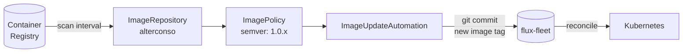

# Alterconso

**Alterconso** est une application de circuit court / épicerie coopérative, déployée pour le tenant `le-portail`. C'est l'unique application avec **image automation** Flux activée.

---

## Sources Helm

| Ressource | Type | URL |
|-----------|------|-----|
| HelmRepository `alterconso` | HelmRepository | `https://raw.githubusercontent.com/gpenaud/helm-charts/master` |
| HelmRelease `alterconso` | — | chart: `alterconso`, version `0.0.5` |

Chart hébergé dans le dépôt personnel `gpenaud/helm-charts`.

---

## Image Automation

Alterconso est configuré pour mettre à jour automatiquement son image container lorsqu'une nouvelle version est publiée :



### ImagePolicy

```yaml
spec:
  imageRepositoryRef:
    name: alterconso
  policy:
    semver:
      range: 1.0.x   # Accepte uniquement les patches (ex: 1.0.3, 1.0.4…)
```

Seules les versions patch de la série `1.0.x` sont acceptées. Les montées de version mineure ou majeure nécessitent une intervention manuelle.

### ImageUpdateAutomation

La mise à jour écrit le nouveau tag d'image directement dans le dépôt Git et crée un commit automatique, déclenchant ensuite la réconciliation Flux normale.

---

## Instances déployées

| Tenant | Namespace | Environnements |
|--------|-----------|----------------|
| le-portail | `le-portail-alterconso` | localhost + production |

---

## Sauvegarde

```bash
task backup:k8up:le-portail:alterconso
```

- `USER_ID: 33` / `GROUP_ID: 33` (utilisateur `www-data`)
- Bucket : `backup-srv1515851-le-portail-alterconso`

La sauvegarde inclut un dump MySQL via PreBackupPod.

---

## Forcer une mise à jour d'image

```bash
# Vérifier l'état de l'image repository
flux --context production -n le-portail-alterconso get imagerepositories

# Forcer un scan immédiat
flux --context production -n le-portail-alterconso reconcile image repository alterconso

# Vérifier la policy
flux --context production -n le-portail-alterconso get imagepolicies
```
