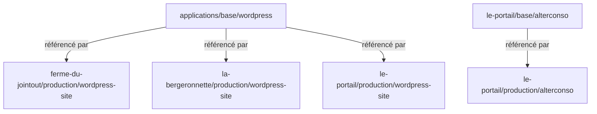

# Applications — Patterns & Overlays

## Architecture base / overlay

Toutes les applications suivent un pattern commun à deux niveaux :

```
applications/
├── base/                          ← Templates génériques (partagés entre tenants)
│   ├── dolibarr/
│   ├── grist/
│   └── wordpress/
│
├── ferme-du-jointout/
│   ├── base/                      ← Templates spécifiques au tenant
│   │   └── nextcloud/
│   ├── localhost/                 ← Overlay développement
│   └── production/                ← Overlay production
│
├── la-bergeronnette/
│   └── production/
│
└── le-portail/
    ├── base/
    │   └── alterconso/
    ├── localhost/
    └── production/
```

### Niveaux d'héritage



---

## Anatomie d'une application base

Chaque application `base/` contient :

| Fichier | Rôle |
|---------|------|
| `namespace.yaml` | Namespace Kubernetes (renommé par patch dans l'overlay) |
| `helm.yaml` | HelmRepository + HelmRelease (sans valeurs tenant-spécifiques) |
| `init-db.yaml` | Job d'initialisation de base de données (si applicable) |
| `backup.yaml` | K8up Schedule + PreBackupPod |
| `kustomization.yaml` | Liste les ressources incluses |

---

## Anatomie d'un overlay

Chaque overlay (`localhost/` ou `production/`) contient :

```yaml
# kustomization.yaml — référence la base et applique des patches
apiVersion: kustomize.config.k8s.io/v1beta1
kind: Kustomization
resources:
  - ../../../base/wordpress

patches:
  # Renomme le namespace
  - target:
      kind: Namespace
    patch: |
      - op: replace
        path: /metadata/name
        value: le-portail-wordpress-site

  # Déplace le HelmRelease dans le bon namespace
  - target:
      kind: HelmRelease
      name: wordpress
    patch: |
      - op: replace
        path: /metadata/namespace
        value: le-portail-wordpress-site

  # Injecte les values.yaml tenant-spécifiques
  - target:
      kind: HelmRelease
      name: wordpress
    patch: |
      - op: add
        path: /spec/valuesFrom
        value:
          - kind: ConfigMap
            name: wordpress-values
          - kind: Secret
            name: wordpress
```

---

## Fichiers dans un overlay

| Fichier | Rôle |
|---------|------|
| `kustomization.yaml` | Référence la base + patches |
| `values.yaml` | Valeurs Helm spécifiques (non chiffrées) |
| `secrets.yaml` | Secrets en clair (**dans `.gitignore`**, ne pas committer) |
| `secrets.enc.yaml` | Secrets chiffrés SOPS (**à committer**) |
| `backup-pod-config.yaml` | Config spécifique du PreBackupPod K8up (si nécessaire) |

---

## Applications par tenant

| Application | Base | ferme-du-jointout | la-bergeronnette | le-portail |
|-------------|------|:-:|:-:|:-:|
| [Dolibarr](dolibarr.md) | `applications/base/dolibarr` | Oui | — | Oui |
| [WordPress](wordpress.md) | `applications/base/wordpress` | Oui | Oui | Oui (×2) |
| [Nextcloud](nextcloud.md) | `ferme-du-jointout/base/nextcloud` | Oui | — | — |
| [Grist](grist.md) | `applications/base/grist` | — | — | Oui |
| [Alterconso](alterconso.md) | `le-portail/base/alterconso` | — | — | Oui |
