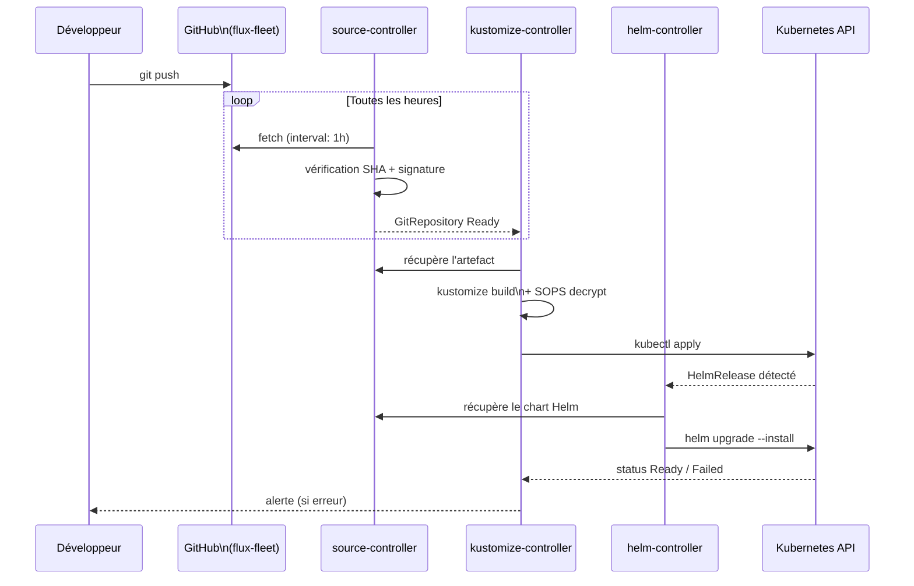
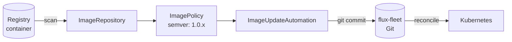

# Flux GitOps — Fonctionnement

## Le cycle GitOps



---

## Sources Flux

Flux supporte plusieurs types de sources de charts :

### GitRepository

Utilisé pour Grist (chart forké) :

```yaml
apiVersion: source.toolkit.fluxcd.io/v1
kind: GitRepository
metadata:
  name: dirnum-forked
spec:
  interval: 5m
  url: https://github.com/gpenaud/helm-charts-dirnum
  ref:
    branch: feature/make-loadbalancer-component-optional
```

### HelmRepository

Utilisé pour Dolibarr, Nextcloud, Longhorn, MySQL Operator :

```yaml
apiVersion: source.toolkit.fluxcd.io/v1
kind: HelmRepository
metadata:
  name: dolibarr
spec:
  interval: 5m
  url: https://cowboysysop.github.io/charts/
```

### OCIRepository

Utilisé pour Traefik et WordPress (Bitnami OCI) :

```yaml
apiVersion: source.toolkit.fluxcd.io/v1
kind: OCIRepository
metadata:
  name: traefik
spec:
  interval: 24h
  url: oci://ghcr.io/traefik/helm/traefik
  ref:
    tag: "39.0.0"
```

---

## Pattern base / overlay

Toutes les applications suivent le pattern Kustomize **base + overlay** :

```
applications/
├── base/
│   └── wordpress/           ← template générique
│       ├── namespace.yaml
│       ├── helm.yaml        ← HelmRelease sans valeurs spécifiques
│       ├── backup.yaml
│       └── kustomization.yaml
│
└── le-portail/
    └── production/
        └── wordpress-site/  ← overlay qui étend la base
            ├── kustomization.yaml  ← référence ../../../base/wordpress
            ├── values.yaml         ← valeurs Helm spécifiques
            └── secrets.enc.yaml    ← secrets chiffrés
```

L'overlay `kustomization.yaml` référence la base et applique des patches :

```yaml
apiVersion: kustomize.config.k8s.io/v1beta1
kind: Kustomization
resources:
  - ../../../base/wordpress
patches:
  - target:
      kind: Namespace
    patch: |
      - op: replace
        path: /metadata/name
        value: le-portail-wordpress-site
  - target:
      kind: HelmRelease
      name: wordpress
    patch: |
      - op: replace
        path: /metadata/namespace
        value: le-portail-wordpress-site
```

---

## Image Automation (Alterconso)

Le tenant `le-portail` utilise l'**image automation** Flux pour mettre à jour automatiquement l'image de l'application `alterconso` :



1. **ImageRepository** scanne le registry à intervalle régulier
2. **ImagePolicy** filtre les tags selon `semver range: 1.0.x`
3. **ImageUpdateAutomation** met à jour le tag dans le dépôt Git et commit automatiquement
4. Flux détecte le nouveau commit et réconcilie

---

## Substitution de variables

Les Kustomizations des clusters injectent des variables via `postBuild.substitute`, résolues dans les fichiers YAML par la syntaxe `${VAR}` :

| Variable | Valeur (localhost) | Valeur (production) |
|----------|--------------------|---------------------|
| `ENVIRONMENT` | `localhost` | `production` |
| `TENANT` | `ferme-du-jointout` / `le-portail` | idem |

```yaml
# Utilisation dans sync.yaml
path: ./applications/le-portail/${ENVIRONMENT}
```

!!! warning "Limites"
    La substitution de variables ne fonctionne que dans les ressources Kustomization Flux (`kustomize.toolkit.fluxcd.io`), pas dans les fichiers YAML appliqués via Kustomize natif.
