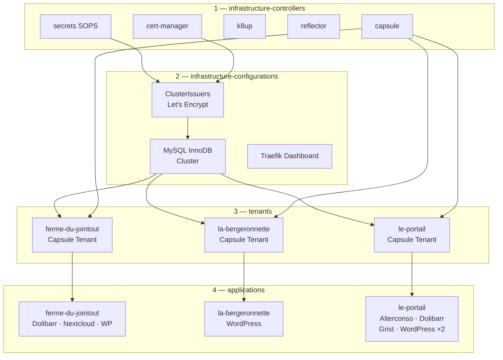
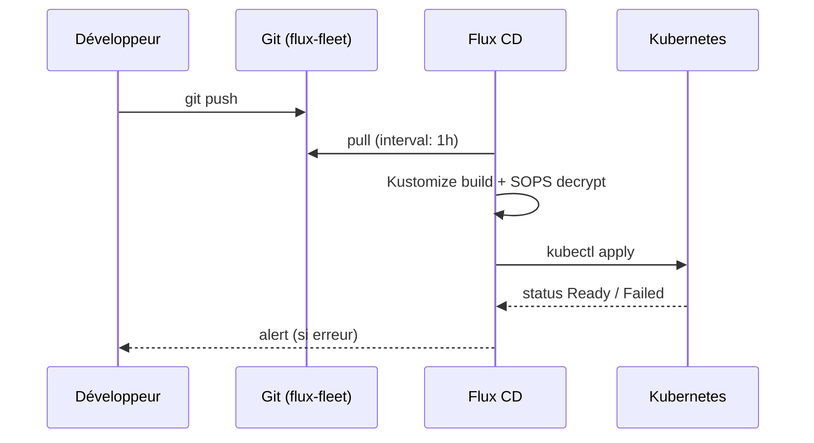

# Architecture — Vue d'ensemble

## Chaîne de dépendances Flux

Flux applique les ressources dans un ordre strict défini par `dependsOn`. Aucune étape ne démarre tant que la précédente n'est pas `Ready`.



---

## Structure du dépôt

```
flux-fleet/
├── clusters/          # Bootstrap Flux par cluster (localhost / production)
├── infrastructure/    # Contrôleurs et configurations cluster-wide
│   ├── controllers/   # Helm releases des opérateurs
│   └── configurations/# ClusterIssuers, MySQL servers…
├── tenants/           # Définitions Capsule Tenant (RBAC)
├── applications/      # Applications par tenant et par environnement
│   ├── base/          # Templates Helm partagés
│   ├── ferme-du-jointout/
│   ├── la-bergeronnette/
│   └── le-portail/
└── tools/             # Taskfile, backup-validator (DevSpace)
```

---

## Flux de réconciliation



!!! info "Interval de réconciliation"
    Toutes les Kustomizations sont configurées avec `interval: 1h` et `retryInterval: 2m`.
    Pour forcer une réconciliation immédiate, voir [Réconciliation](../operations/reconcile.md).

---

## Environnements et substitution de variables

Chaque cluster injecte `ENVIRONMENT` via `postBuild.substitute` dans les Kustomizations `applications` et `tenants`. Les `sync.yaml` des tenants utilisent cette variable pour pointer vers le bon overlay :

```yaml
# clusters/production/applications.yaml
postBuild:
  substitute:
    ENVIRONMENT: production
```

```yaml
# applications/le-portail/sync.yaml
path: ./applications/le-portail/${ENVIRONMENT}
```
