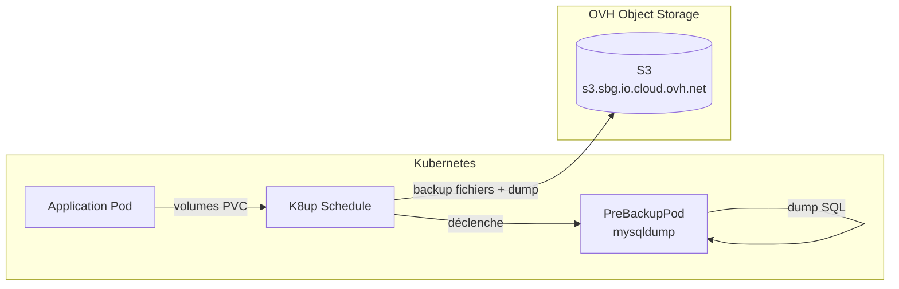

# Stratégie de sauvegarde

Les sauvegardes sont gérées par **[K8up](https://k8up.io)**, un opérateur Kubernetes basé sur [Restic](https://restic.net). Chaque application dispose de sa propre ressource `Schedule` K8up.

---

## Architecture



---

## Cycle d'une sauvegarde

Chaque `Schedule` K8up orchestre trois opérations :

| Opération | Rôle |
|-----------|------|
| `backup` | Sauvegarde incrémentale des volumes et dumps SQL vers S3 |
| `check` | Vérification de l'intégrité du dépôt Restic |
| `prune` | Suppression des anciennes sauvegardes selon la politique de rétention |

---

## Planification (exemple WordPress)

```yaml
spec:
  backup:
    schedule: '0 21 1,15 * *'   # 1er et 15 de chaque mois à 21h
  check:
    schedule: '30 21 1,15 * *'  # 30 min après le backup
  prune:
    schedule: '0 22 1,15 * *'   # 1h après le backup
    retention:
      keepWeekly: 8              # ~4 mois
      keepMonthly: 6             # 6 mois de rétention mensuelle
```

---

## Dump de base de données (PreBackupPod)

Avant chaque sauvegarde, K8up démarre un `PreBackupPod` qui exécute `mysqldump` :

```yaml
spec:
  backupCommand: >
    sh -c 'mysqldump
      --no-tablespaces
      --skip-set-charset
      --set-gtid-purged=OFF
      --single-transaction
      -h mysql-version-8-lts.controller-mysql-operator.svc.cluster.local
      -u $WORDPRESS_MYSQL_USER
      -p"$WORDPRESS_MYSQL_PASSWORD"
      $WORDPRESS_MYSQL_DATABASE'
  fileExtension: .sql
```

!!! note "Le dump est inclus dans la sauvegarde Restic"
    K8up collecte le fichier `.sql` produit par le `PreBackupPod` et l'inclut dans le snapshot Restic, aux côtés des données des volumes PVC.

---

## Backend S3

| Paramètre | Valeur |
|-----------|--------|
| Endpoint  | `https://s3.sbg.io.cloud.ovh.net` |
| Provider  | OVH Object Storage (région SBG) |
| Auth      | Secret `k8up-credentials` (SOPS chiffré) |
| Chiffrement | Restic (mot de passe dans secret `k8up-credentials`) |

---

## Applications sauvegardées

| Application | Tenant(s) | Type de données |
|-------------|-----------|-----------------|
| WordPress | tous | volumes WP + dump MySQL |
| Dolibarr | ferme-du-jointout, le-portail | volumes + dump MySQL |
| Nextcloud | ferme-du-jointout | volumes + dump MySQL |
| Grist | le-portail | volumes |
| Alterconso | le-portail | volumes + dump MySQL |

!!! warning "Vérifier les sauvegardes"
    Utilisez régulièrement `task backup:k8up:*` pour déclencher des sauvegardes manuelles et valider les dépôts Restic avec le backup-validator (voir `tools/backup-validator/`).
