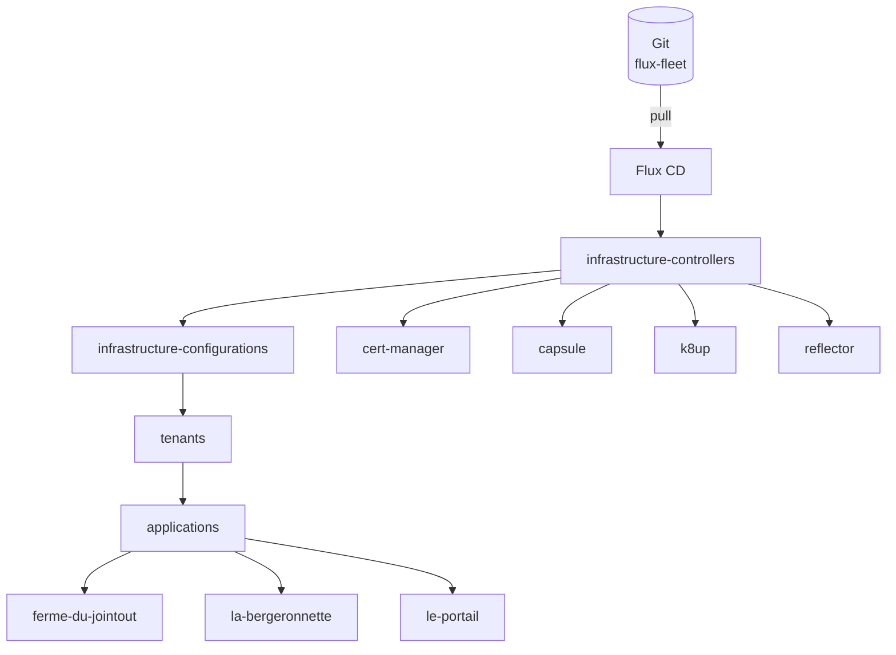

# Flux Fleet

**Flux Fleet** est le dépôt GitOps central de l'infrastructure Kubernetes multi-tenant. Il orchestre le déploiement et la gestion de l'ensemble des applications, des contrôleurs d'infrastructure et des configurations cluster via [Flux CD](https://fluxcd.io).

---

## Vue d'ensemble

---

## Clusters

| Cluster | Usage | TLS | Stockage |
|---------|-------|-----|----------|
| `localhost` | Développement local | mkcert | emptyDir |
| `production` | Production | Let's Encrypt | Longhorn |

---

## Tenants

| Tenant | Applications |
|--------|-------------|
| [ferme-du-jointout](tenants/ferme-du-jointout.md) | Dolibarr, Nextcloud, WordPress |
| [la-bergeronnette](tenants/la-bergeronnette.md) | WordPress |
| [le-portail](tenants/le-portail.md) | Alterconso, Dolibarr, Grist, WordPress (×2) |

---

## Technologies clés

- **[Flux CD](https://fluxcd.io)** — GitOps operator (source de vérité : ce dépôt)
- **[Kustomize](https://kustomize.io)** — Gestion des overlays par environnement
- **[Helm](https://helm.sh)** — Packaging des applications
- **[Capsule](https://capsule.clastix.io)** — Multi-tenancy Kubernetes
- **[K8up](https://k8up.io)** — Sauvegardes automatisées (Restic + S3)
- **[SOPS](https://github.com/getsops/sops) + [age](https://age-encryption.org)** — Chiffrement des secrets dans Git
- **[Traefik](https://traefik.io)** — Ingress controller
- **[Longhorn](https://longhorn.io)** — Stockage distribué (production)
- **[MySQL Operator](https://dev.mysql.com/doc/mysql-operator/en/)** — Base de données InnoDB Cluster
