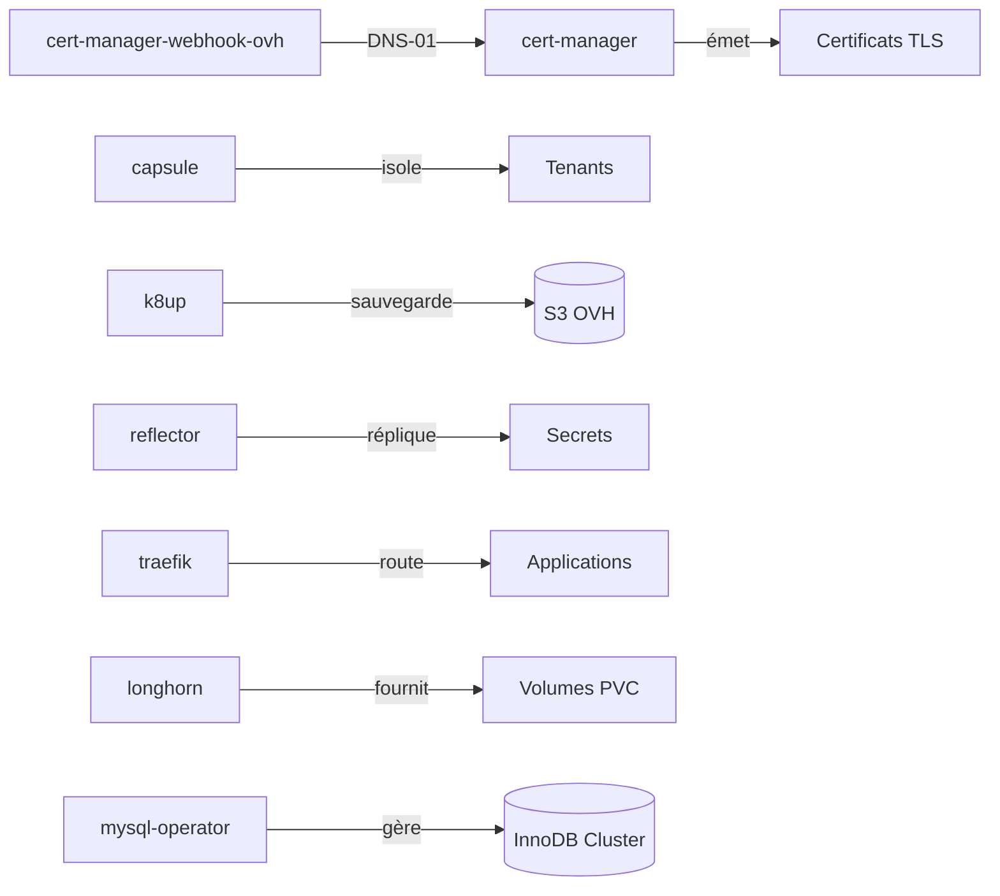

# Contrôleurs d'infrastructure

Les contrôleurs sont des opérateurs cluster-wide déployés via Helm dans le namespace `controller-<nom>`. Ils constituent la couche socle sur laquelle s'appuient toutes les applications.

---

## Vue d'ensemble



---

## cert-manager

Gestion automatique des certificats TLS.

- **Source** : OCI chart (`oci://quay.io/jetstack/cert-manager`)
- **Namespace** : `controller-cert-manager`
- **Présent** : localhost + production

En production, la validation des certificats utilise le challenge **DNS-01** via le webhook OVH, ce qui permet d'émettre des certificats wildcard et pour des domaines sans exposition publique du cluster.

```yaml
# Référencer un certificat dans une ressource Ingress/IngressRoute
annotations:
  cert-manager.io/cluster-issuer: letsencrypt-production
```

Voir [Configurations → ClusterIssuers](configurations.md#clusterissuers) pour les détails des issuers.

---

## cert-manager-webhook-ovh

Plugin cert-manager pour la validation DNS-01 via l'API OVH.

- **Namespace** : `controller-cert-manager`
- **Présent** : localhost + production
- **Credentials** : secrets `dns-ovh` et `dns-ovh-ferme-du-jointout` (SOPS chiffrés)

---

## Capsule

Opérateur de multi-tenancy Kubernetes.

- **Source** : Helm chart officiel
- **Namespace** : `controller-capsule`
- **Présent** : localhost + production

Capsule intercepte les créations de namespaces et applique les quotas, labels et politiques définis dans les ressources `Tenant`. Voir [Multi-tenancy](../tenants/overview.md) pour les détails.

---

## K8up

Opérateur de sauvegarde basé sur Restic.

- **Source** : Helm chart K8up
- **Namespace** : `controller-k8up`
- **Présent** : localhost + production

K8up surveille les ressources `Schedule`, `Backup`, et `PreBackupPod` dans tous les namespaces et orchestre les sauvegardes vers S3. Voir [Sauvegardes](../backups/overview.md) pour les détails.

---

## Reflector

Réplication de Secrets et ConfigMaps entre namespaces.

- **Source** : `emberstack/kubernetes-reflector`
- **Namespace** : `controller-reflector`
- **Présent** : localhost + production

Utilisé principalement pour répliquer le secret `mysql-operator` (mot de passe root) et les credentials S3 (`s3-ovh`) dans les namespaces des applications.

Annotation de configuration :
```yaml
metadata:
  annotations:
    reflector.v1.k8s.emberstack.com/reflection-allowed: "true"
    reflector.v1.k8s.emberstack.com/reflection-auto-enabled: "true"
```

---

## Traefik

Ingress controller et reverse proxy.

- **Source** : OCIRepository `oci://ghcr.io/traefik/helm/traefik`, tag `39.0.0`
- **Namespace** : `controller-traefik`
- **Présent** : localhost + production (configurations différentes)

Configuration production :
- Redirection HTTP → HTTPS automatique (permanente)
- Dashboard activé
- `allowCrossNamespace: true` pour les IngressRoutes multi-tenants

Voir [Ingress (Traefik)](ingress.md) pour les détails.

---

## Longhorn (production uniquement)

Système de stockage distribué.

- **Source** : HelmRepository `https://charts.longhorn.io`, version `v1.x`
- **Namespace** : `controller-longhorn`
- **Présent** : production uniquement

Configuration :
- `defaultDataPath: /var/lib/longhorn`
- StorageClass par défaut : XFS, 1 réplique
- StorageClass supplémentaire `longhorn-ext4` : ext4, 2 répliques, `reclaimPolicy: Retain`
- UI accessible via `longhorn.leportail.org` (cert-manager staging)

!!! note "Localhost"
    En localhost, k3s utilise la StorageClass `local-path` par défaut.

---

## MySQL Operator (production uniquement)

Opérateur MySQL InnoDB Cluster.

- **Source** : HelmRepository `https://mysql.github.io/mysql-operator/`
- **Namespace** : `controller-mysql-operator`
- **Présent** : production uniquement

L'opérateur gère le cycle de vie d'un cluster InnoDB MySQL 8.4.3. Voir [Configurations](configurations.md#mysql-innodb-cluster) pour les détails du cluster.

!!! note "Localhost"
    En localhost, les applications utilisent MariaDB embarqué dans leurs charts Helm respectifs.
