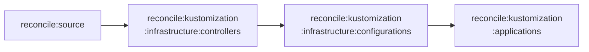

# Réconciliation Flux

Par défaut, Flux réconcilie toutes les Kustomizations toutes les **heures**. Pour appliquer un changement immédiatement, utilisez les tâches de réconciliation.

---

## Via Taskfile (recommandé)

=== "Source Git"

    Recharge la source Git flux-system (déclenche ensuite tous les watchers) :

    ```bash
    task reconcile:source
    ```

    Équivalent flux :
    ```bash
    flux --context production -n flux-system reconcile source git flux-system
    ```

=== "Infrastructure complète"

    Réconcilie les contrôleurs puis les configurations :

    ```bash
    task reconcile:kustomization:infrastructure
    ```

=== "Contrôleurs uniquement"

    ```bash
    task reconcile:kustomization:infrastructure:controllers
    ```

=== "Configurations uniquement"

    ```bash
    task reconcile:kustomization:infrastructure:configurations
    ```

=== "Applications"

    ```bash
    task reconcile:kustomization:applications
    ```

---

## Via flux CLI directement

### Forcer la réconciliation d'une Kustomization

```bash
flux --context production -n flux-system reconcile kustomization <nom>
```

### Suspend / Resume

La méthode `suspend + resume` force une re-application complète, utile quand `reconcile` ne suffit pas :

```bash
# Suspendre
flux --context production -n flux-system suspend kustomization <nom>

# Reprendre (force re-apply immédiat)
flux --context production -n flux-system resume kustomization <nom>
```

### Réconcilier un HelmRelease

```bash
flux --context production -n <namespace> reconcile helmrelease <nom>
```

---

## Observer l'état des Kustomizations

```bash
# Toutes les Kustomizations
flux --context production -n flux-system get kustomizations

# Détail d'une Kustomization
flux --context production -n flux-system describe kustomization applications

# Suivre les événements en temps réel
flux --context production -n flux-system events --watch
```

---

## Ordre de réconciliation conseillé après un gros changement



!!! tip "En cas de blocage"
    Si une Kustomization reste en `Progressing` indéfiniment, vérifiez les logs du controller :
    ```bash
    kubectl -n flux-system logs deploy/kustomize-controller -f
    ```
