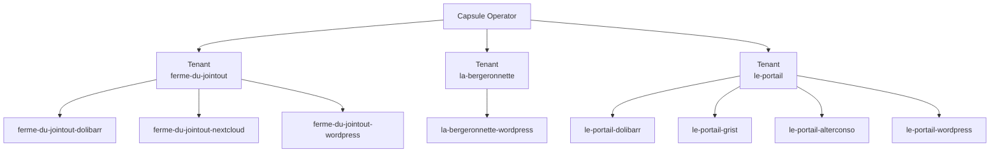

# Multi-tenancy

L'isolation multi-tenant est assurée par **[Capsule](https://capsule.clastix.io)**, un opérateur Kubernetes qui étend le modèle RBAC natif avec une notion de `Tenant`.

---

## Concept



---

## Structure d'un Tenant Capsule

Chaque tenant est défini par une ressource `Tenant` (CRD Capsule) :

```yaml
apiVersion: capsule.clastix.io/v1beta2
kind: Tenant
metadata:
  name: le-portail
spec:
  owners:
    - name: le-portail-admin
      kind: User
    - name: local
      kind: User
  namespaceOptions:
    quota: 10                          # Max 10 namespaces par tenant
    additionalMetadata:
      labels:
        capsule.clastix.io/tenant: le-portail  # Label auto sur tous les namespaces
```

---

## Tenants

| Tenant | Owner | Quota NS | Environnements |
|--------|-------|----------|----------------|
| [ferme-du-jointout](ferme-du-jointout.md) | `ferme-du-jointout-admin` | 10 | localhost + production |
| [la-bergeronnette](la-bergeronnette.md) | `la-bergeronnette-admin` | 10 | production uniquement |
| [le-portail](le-portail.md) | `le-portail-admin` | 10 | localhost + production |

---

## Convention de nommage des namespaces

Les namespaces suivent la convention `{tenant}-{application}` :

```
ferme-du-jointout-dolibarr
ferme-du-jointout-nextcloud
le-portail-grist
la-bergeronnette-wordpress
```

Cette convention est appliquée via des patches Kustomize dans chaque overlay :

```yaml
# applications/le-portail/production/dolibarr/kustomization.yaml
patches:
  - target:
      kind: Namespace
    patch: |
      - op: replace
        path: /metadata/name
        value: le-portail-dolibarr
```

---

## Ordre de déploiement

Les tenants sont déployés **après** `infrastructure-configurations` et **avant** `applications`, garantissant que les namespaces Capsule existent avant que les applications tentent d'y être déployées.

```yaml
# clusters/production/tenant.yaml
spec:
  dependsOn:
    - name: infrastructure-configurations
```

!!! info "Flux et Capsule"
    Flux déploie dans le namespace `flux-system` avec un compte de service cluster-admin. Capsule n'intercepte pas les ressources créées par des comptes disposant du rôle `cluster-admin`.
